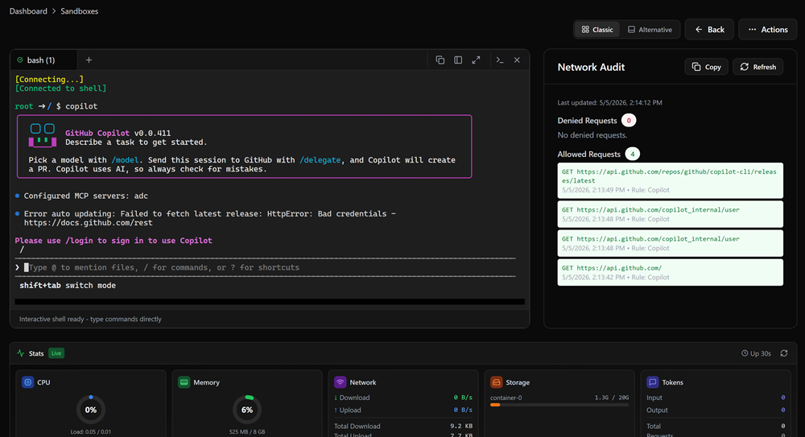

---
title: Azure Container Apps Sandboxes overview
description: Learn about Azure Container Apps Sandboxes, a first-class resource type for fast, secure, ephemeral compute environments with suspend and resume capabilities.
ms.topic: concept-article
ms.service: azure-container-apps
ms.date: 05/06/2026
---

# Azure Container Apps Sandboxes overview

Azure Container Apps Sandboxes provide fast, secure, ephemeral compute environments with built-in suspend and resume capabilities. Sandboxes are a first-class resource type (`Microsoft.App/SandboxGroups`) in Container Apps, alongside apps, jobs, and dynamic sessions.

Where [dynamic sessions](../dynamic-sessions/overview.md) provide a managed execution experience that abstracts away infrastructure, Sandboxes give you direct, programmable control over isolated compute environments. You manage the full sandbox lifecycle, including state snapshots, persistent storage, and networking policies.

Inside a sandbox you can run full terminal shells. The following screenshot shows how you can run GitHub Copilot in a sandbox.

> **Note:** Azure Container Apps Sandboxes are currently in private preview. Contact your Microsoft representative for access.

## Key characteristics

- **Sub-second startup**: Sandboxes are provisioned from prewarmed pools for near-instant availability.
- **Strong isolation**: Each sandbox runs in its own secure boundary, safe for untrusted code execution.
- **Scale to zero**: Pay nothing when sandboxes are idle.
- **Massive scale-out**: Burst to thousands of concurrent sandboxes on demand.
- **OCI container image support**: Bring your own container images as sandbox root filesystems.
- **Suspend and resume**: Snapshot full state including memory and disk, and resume later with sub-second restore times.

## When to use Sandboxes

Sandboxes are a good fit when you need isolated compute environments with explicit lifecycle control, persistent state, or programmable access through SDKs.

| Scenario | Use Sandboxes? | Why |
|---|---|---|
| AI code execution with state preservation | Yes | Suspend between tasks, resume with full context intact |
| Development environments | Yes | On-demand, suspendable environments that preserve state across sessions |
| Agent workflows | Yes | Give AI agents persistent, isolated workspaces across task boundaries |
| Interactive user sessions | Yes | Each user gets their own isolated compute environment |
| Secure multi-tenant compute | Yes | Strong isolation for running untrusted workloads from multiple tenants |
| Burst workloads | Yes | Scale from zero to thousands of sandboxes on demand |
| CI/CD pipelines | Yes | Ephemeral build and test environments that scale to zero when idle |

### Choose the right Container Apps compute option

Use the following table to select the Container Apps compute type that fits your workload.

| Compute type | Best for | Lifecycle | State |
|---|---|---|---|
| **Apps** | Long-running services, APIs, web apps | Continuous | Stateless (external state stores) |
| **Jobs** | Run-to-completion tasks, batch processing | Start → run → complete | Stateless |
| **Dynamic Sessions** | Managed code execution, LLM-generated scripts | Managed by session pool | Ephemeral |
| **Sandboxes** | Programmable isolated compute with lifecycle control | You manage: create, suspend, resume, delete | Stateful (snapshots, volumes) |

## Key concepts

### Sandbox groups

A sandbox group is the top-level management boundary for sandboxes. It's an Azure Resource Manager (ARM) resource that you create in a resource group and region. All sandboxes, disk images, snapshots, volumes, and secrets are scoped to a sandbox group.

Use sandbox groups to organize sandboxes by application, team, or environment.

### Sandboxes

A sandbox is an individual isolated compute instance within a sandbox group. Each sandbox runs from a disk image or snapshot and has its own CPU, memory, disk, and network boundary.

You interact with sandboxes by executing commands, managing files, exposing ports, and controlling lifecycle state.

### Disk images

Disk images are OCI container images converted for use as sandbox root filesystems. You can use public images or create private images from your own container registries.

You can build disk images from:

- **Public images**: Prebuilt images available to all sandbox groups.
- **Container registry images**: Pull from public or private registries with optional authentication.
- **Dockerfiles**: Build custom images with a Dockerfile.

### Snapshots

Snapshots capture the full state of a running sandbox, including memory and disk. Use snapshots to:

- **Suspend and resume**: Pause a sandbox and restore it later with all processes and data intact.
- **Clone environments**: Create new sandboxes from a known-good state.
- **Share baselines**: Distribute preconfigured environments across your team.

### Volumes

Volumes provide persistent storage that you can mount into sandboxes. Two volume types are available:

| Volume type | Description |
|---|---|
| **Azure Blob** | Cloud object storage with file explorer, upload, and download support |
| **Data Disk** | Block storage that attaches directly to a sandbox |

### Lifecycle states

Sandboxes transition through the following states:

| State | Description |
|---|---|
| Running | Actively executing |
| Suspended | Auto-suspended with full state preserved (memory and disk) |
| Idle | System-suspended, can auto-resume on demand |
| Stopped | User-initiated stop |
| Resuming | Waking from suspended or idle state |
| Creating | Provisioning in progress |
| Stopping | Shutdown in progress |
| Deleting | Teardown in progress |

You can configure automatic lifecycle policies for each sandbox:

- **Auto-suspend**: Suspend idle sandboxes after a configurable timeout. Choose between memory mode (full snapshot) or disk mode (preserve disk only).
- **Auto-delete**: Automatically delete sandboxes after a specified number of days.

## Architecture

Sandboxes use a two-plane architecture:

| Plane | Endpoint | Operations |
|---|---|---|
| **ARM control plane** | `management.azure.com` | Create, update, delete, and list sandbox groups. Manage VNet connections. |
| **ADC data plane** | `management.azuredevcompute.io` | Manage sandboxes, disk images, snapshots, files, volumes, secrets, ports, and egress policies. |

You create and manage sandbox groups through the ARM control plane. All operations on individual sandboxes and their resources go through the ADC data plane, scoped to a specific sandbox group.

## SDK support

You can manage sandboxes programmatically using dedicated SDKs. SDK capabilities vary by language.

| SDK | Language | Scope | Authentication |
|---|---|---|---|
| `Microsoft.Adc.Arm.Client` | C# | ARM control plane and data plane | Microsoft Entra ID via `Azure.Identity` |
| `adc` | Python | Data plane only | API key or bearer token |

> **Note:** SDK capabilities currently differ by language. The C# SDK supports both control plane and data plane operations, while the Python SDK supports data plane operations only.

## Resource tiers

Each sandbox is assigned a resource tier that determines its CPU, memory, and disk allocation.

| Tier | CPU | Memory | Disk |
|---|---|---|---|
| XS | 0.25 cores | 0.5 GB | 20 GB |
| S | 0.5 cores | 1 GB | 20 GB |
| M (default) | 1 core | 2 GB | 20 GB |
| L | 2 cores | 4 GB | 40 GB |

## Region availability

During the preview, sandboxes are available in the **West Central US** region.

## Considerations

Keep the following points in mind when working with sandboxes:

- **Entra ID required**: Only Microsoft Entra ID accounts can access sandboxes. Personal Microsoft accounts aren't supported.
- **Preview feature availability**: Some capabilities, such as custom VNet integration and managed identity for image pull, require feature flags during the preview period.
- **Networking controls**: You can configure egress policies to control outbound traffic from sandboxes, including domain-based allow or deny rules and CIDR-based network rules.

## Sandboxes vs. dynamic sessions

Sandboxes and [dynamic sessions](../dynamic-sessions/overview.md) both provide isolated compute environments in Container Apps, but they serve different needs.

| | Dynamic sessions | Sandboxes |
|---|---|---|
| **Access pattern** | HTTP request routing through a session pool management endpoint | Direct SDK and CLI control over individual sandboxes |
| **State** | Ephemeral, destroyed after cooldown | Stateful with suspend, resume, and snapshots |
| **Developer control** | Pool manages allocation and lifecycle | You manage sandbox lifecycle, files, ports, and policies |
| **Image model** | Code interpreter (built-in) or custom container | Disk images (OCI), snapshots, content packages |
| **Persistent storage** | Not available | Volumes (Azure Blob, Data Disk) |
| **Networking** | Basic isolation | Egress policies, VNet integration, port management |
| **SDKs** | REST API through pool endpoint | Dedicated SDKs (C#, Python) |

Choose dynamic sessions when you need a managed execution experience that abstracts infrastructure. Choose Sandboxes when you need programmable control over isolated compute with state persistence.

## Related content

- [Snapshots and state management for sandboxes](sandboxes-snapshots-state-management.md)
- [Egress policies and network controls for sandboxes](sandboxes-egress-policies.md)