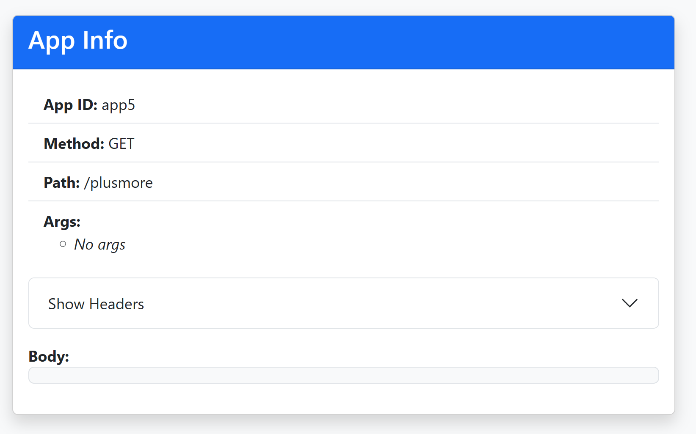

# AllApp

A minimal Flask app for Azure Container Apps. Displays request info (app ID, method, path, args, headers) in a simple Bootstrap UI.

## Screenshot



## Quickstart

1. Build the container:
   ```sh
   docker build -t allapp .
   ```
2. Run locally:
   ```sh
   docker run -e APP_ID=local -p 8080:8080 allapp
   ```
3. Visit [http://localhost:8080](http://localhost:8080)
